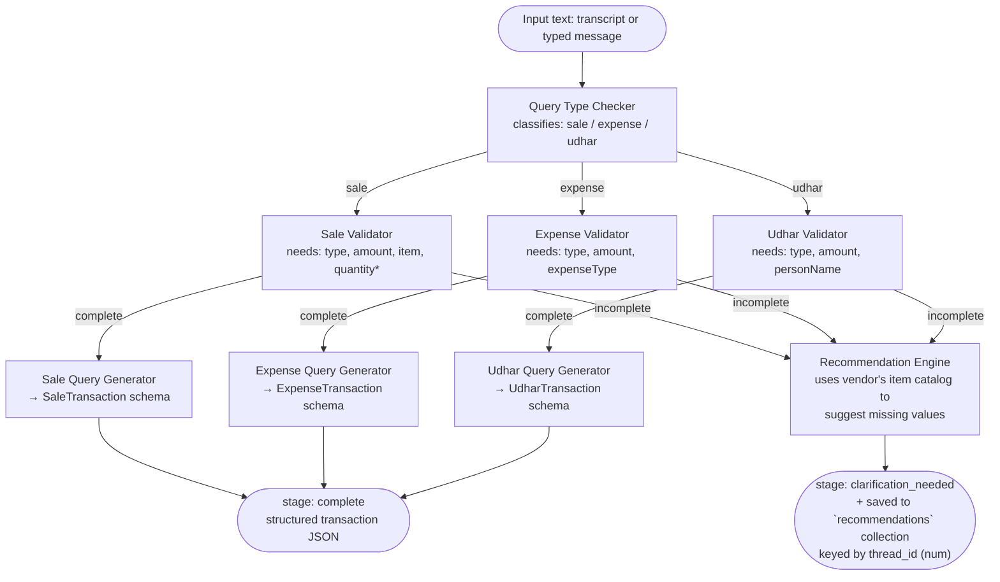
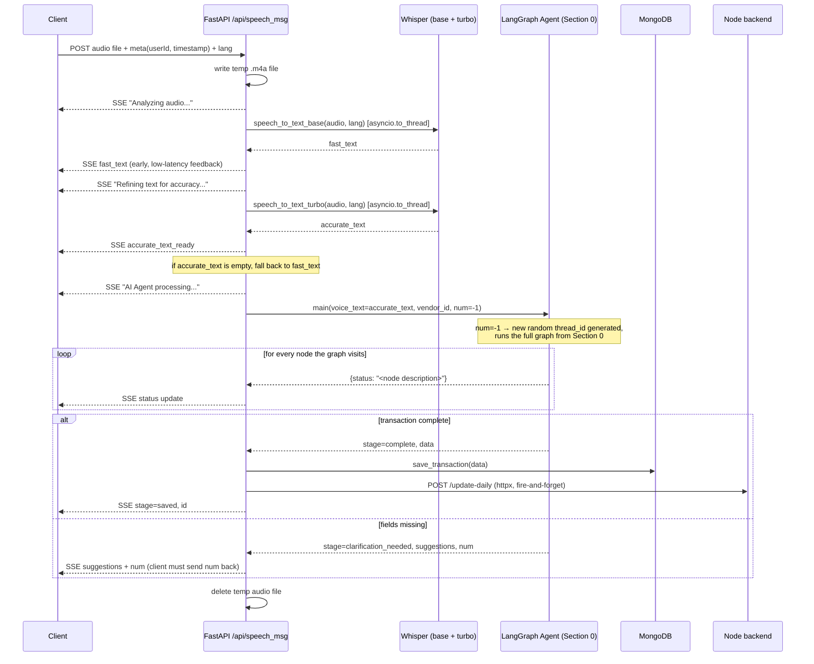
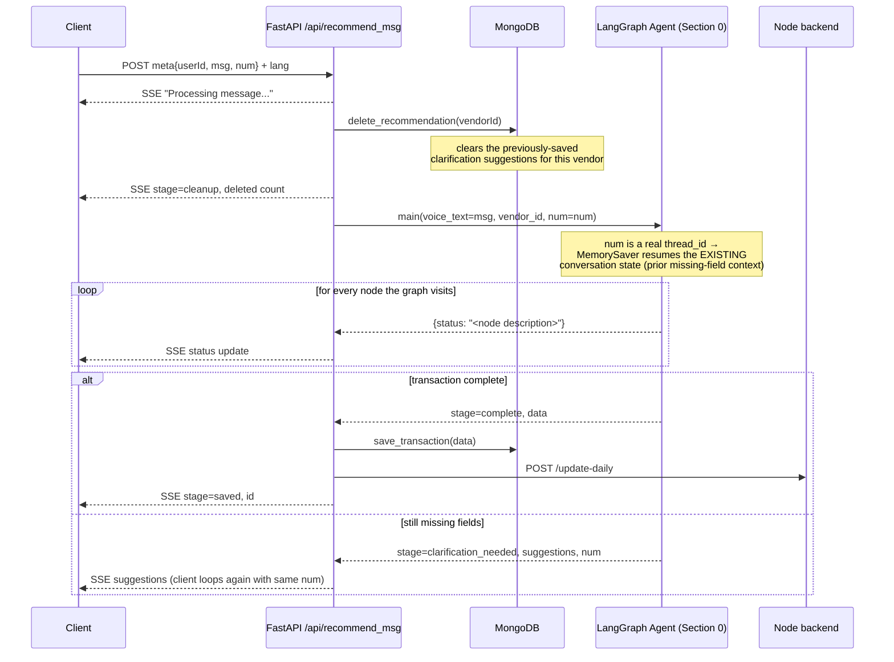
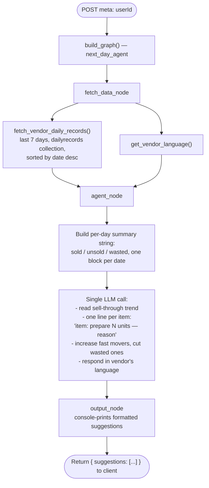
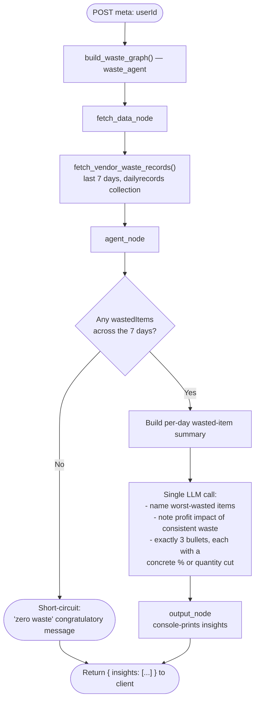

# Architecture — API Endpoint Flows

This service exposes 4 endpoints. Two of them (`/api/speech_msg`, `/api/recommend_msg`)
both drive the **same internal LangGraph agent** (`agents/text_db_agent.py`) — one starts
a new conversation, the other resumes one. The other two (`/api/next_day_suggestions`,
`/api/waste_insights`) are independent, single-shot LangGraph pipelines over historical data.

---

## 0. Shared core: the transaction-extraction graph

Both `/api/speech_msg` and `/api/recommend_msg` call `agents.text_db_agent.main(...)`,
which runs this graph. Understanding this once makes both endpoint diagrams below trivial.

**Explanation**

- `Query Type Checker` is a single structured-output LLM call that only ever returns
  `sale | expense | udhar` — it's the entry router (`route_by_type`).
- Each `Validator` is a **strict, no-inference completeness check** (`Check` schema:
  `flag`, `missing[]`) — it never extracts values, only judges whether extraction is safe.
  This is the fail-fast gate described in the decisions doc: it exists so the extraction
  step downstream never has to invent a plausible amount to satisfy its schema.
- `route_query` reads that `flag` and sends the flow either to a **Query Generator**
  (real extraction into a Pydantic schema) or to the **Recommendation Engine**.
- The Recommendation Engine pulls the vendor's real item catalog (via
  `get_vendor_attributes`) and asks the LLM to phrase 1–3 natural "did you mean...?"
  completions in the vendor's language, then persists them (`save_recommendation`)
  tagged with the conversation's `thread_id` — this is what lets `/api/recommend_msg`
  resume the exact same conversation on the next user reply.
- `MemorySaver` (LangGraph checkpointer) + `thread_id = num` is what makes the graph
  stateful across two separate HTTP requests — without it, every message would be
  treated as a brand-new conversation with no memory of what was already asked.

---

## 1. `POST /api/speech_msg` — voice-in, first turn of a conversation

**Explanation**

- Two Whisper passes are **raced, not chosen** — `base` streams a rough transcript
  immediately so the UI never sits idle; `turbo` streams the accurate one shortly after
  and is what actually feeds the agent. See the decisions doc for the latency/accuracy
  tradeoff.
- `num=-1` tells `main()` this is a **fresh conversation** — it mints a new
  `thread_id` (`random.randint(1000, 9999)`) rather than resuming an old one.
- Every LangGraph node transition is surfaced to the client as a distinct SSE event
  (`NODE_DESCRIPTIONS` maps node → human-readable status) — the client gets granular
  progress instead of a single opaque "loading" spinner across a multi-second pipeline.
- The `complete` branch triggers two side effects outside the graph itself: persisting
  the transaction (`save_transaction`) and notifying the Node backend to recompute the
  vendor's daily aggregate — this keeps rollup/analytics logic out of the Python service.
- If the graph instead lands on `clarification_needed`, the response includes `num` —
  the client is expected to hand that back on the next message so the conversation
  resumes instead of restarting. That's the handoff to endpoint 2.
- Temp audio file cleanup happens in a `finally` block regardless of outcome.

---

## 2. `POST /api/recommend_msg` — text-in, resumes or continues a conversation

**Explanation**

- This endpoint is what the client calls **in response to a clarification prompt** from
  endpoint 1 (or a previous call to itself) — `msg` is the user's typed/spoken follow-up
  ("2 pizzas" after being asked for quantity), and `num` is the `thread_id` returned earlier.
- Old recommendations for that vendor are deleted first — they're stale once the user
  is answering them; this prevents the `recommendations` collection from accumulating
  dead clarification rounds.
- Because `num` is passed through unchanged, LangGraph's checkpointer reloads the exact
  graph state from where it left off — the model doesn't need the *whole* original
  message repeated, only the missing piece, because conversational context already
  lives in the checkpointer.
- Same `complete` vs `clarification_needed` branching and side effects as endpoint 1 —
  this is intentionally the same tail logic, since both endpoints funnel into the same
  graph and the same save path.

---

## 3. `POST /api/next_day_suggestions` — stock planning for tomorrow

**Explanation**

- No streaming here — this is a single `ainvoke()` on a 3-node linear graph
  (`fetch_data → agent → output`), so the endpoint just returns a plain JSON list once
  the whole thing finishes. There's no multi-turn or branching need, so LangGraph is
  used here more for consistency/composability with the rest of the codebase than
  because the control flow demands it.
- `fetch_data_node` does two independent async lookups (records + language) — both are
  awaited before `agent_node` runs, so the prompt always has language context even
  though the fetch is technically two separate DB calls.
- The prompt explicitly asks the model to reason about *trend*, not just today's
  numbers — 7 days of sold/unsold/wasted lines give it the pattern to increase or
  cut quantities from.

---

## 4. `POST /api/waste_insights` — loss/waste analysis

**Explanation**

- Same 3-node shape as endpoint 3, reusing the pattern (`fetch_data → agent → output`),
  but note it fetches the *same* `dailyrecords` collection — the waste graph could in
  principle share a fetch function with the next-day graph, but currently duplicates
  its own `fetch_vendor_waste_records` (worth flagging as a small refactor opportunity
  if asked "what would you clean up").
- `agent_node` has an explicit early exit when there's no waste at all, avoiding a
  wasted (no pun intended) LLM call and giving a clean positive-reinforcement message
  instead of forcing the model to invent advice from nothing.
- The prompt is deliberately constrained to **exactly 3 bullets, each with a concrete
  number** (`%` or unit count) — this is a prompt-engineering choice to keep advice
  actionable rather than vague ("reduce waste") which is useless to a street vendor
  making prep-quantity decisions.

---

## Cross-cutting notes (useful if asked "how do these endpoints relate")

- **Endpoints 1 & 2** share one stateful LangGraph instance and one Mongo write path
  (`save_transaction`) — they're really "the same feature, two entry points" (voice vs.
  follow-up text), unified by `thread_id`.
- **Endpoints 3 & 4** are read-only analytics endpoints, each its own throwaway graph
  instance built per-request (`build_graph()` / `build_waste_graph()` called inside the
  handler, not once at startup) — stateless, single-shot, no checkpointer needed since
  there's no multi-turn conversation to resume.
- All four ultimately bottom out in the same two things: an LLM call over data pulled
  from Mongo, and (for 1 & 2 only) a write back to Mongo plus a downstream notify to
  the Node service.